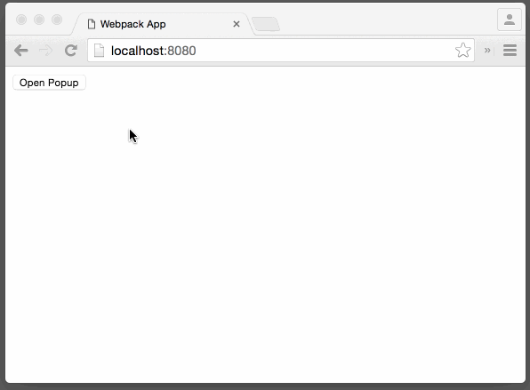

# react-page-click [](https://www.npmjs.com/package/react-page-click)

[](https://gitter.im/nkbt/help)

[](https://circleci.com/gh/nkbt/react-page-click)
[](https://ci.appveyor.com/project/nkbt/react-page-click)
[](https://codecov.io/github/nkbt/react-page-click?branch=master)
[](https://david-dm.org/nkbt/react-page-click)
[](https://david-dm.org/nkbt/react-page-click#info=devDependencies)

React component-wrapper to detect page clicks (outside of wrapped element).





## Installation

### NPM

```sh
npm install --save react react-page-click
```

Don't forget to manually install peer dependencies (`react`) if you use npm@3.


### Bower:
```sh
bower install --save https://npmcdn.com/react-page-click/bower.zip
```

or in `bower.json`

```json
{
  "dependencies": {
    "react-page-click": "https://npmcdn.com/react-page-click/bower.zip"
  }
}
```

then include as
```html
<script src="bower_components/react/react.js"></script>
<script src="bower_components/react-page-click/build/react-page-click.js"></script>
```


### 1998 Script Tag:
```html
<script src="https://npmcdn.com/react/dist/react.js"></script>
<script src="https://npmcdn.com/react-page-click/build/react-page-click.js"></script>
(Module exposed as `PageClick`)
```


## Demo

[http://nkbt.github.io/react-page-click/example](http://nkbt.github.io/react-page-click/example)

## Codepen demo

[http://codepen.io/nkbt/pen/JYEPVQ](http://codepen.io/nkbt/pen/JYEPVQ?editors=101)

## Usage

Show only when `this.state.opened` and hide by click anywhere on a page outside of `.popup` element.

```js
{this.state.opened ? (
  <PageClick onClick={() => this.setState({opened: false})}>
    <div className="popup">
      Some Popup content
    </div>
  </PageClick>
) : null}
```


## Modal window example

```js
import React from 'react';
import ReactDOM from 'react-dom';
import PageClick from 'react-page-click';


const styles = {
  popup: {
    position: 'fixed',
    top: '50%',
    left: '50%',
    width: '40%',
    height: '40%',
    marginTop: '-20%',
    marginLeft: '-20%',

    fontSize: 30,
    textAlign: 'center',

    background: 'rgba(255, 255, 255, 0.9)',
    borderRadius: 10
  },
  shade: {
    position: 'fixed',
    top: 0,
    left: 0,
    right: 0,
    bottom: 0,
    background: 'rgba(0, 0, 0, 0.3)'
  },
  content: {
    padding: 50
  }
};

const Modal = React.createClass({
  propTypes: {
    onClose: React.PropTypes.func.isRequired
  },

  render() {
    const {onClose, ...props} = this.props;

    return (
      <div>
        <div style={styles.shade} />
        <PageClick onClick={this.props.onClose}>
          <div style={styles.popup}>
            <div style={styles.content} {...props} />
          </div>
        </PageClick>
      </div>
    );
  }
});


const App = React.createClass({
  getInitialState() {
    return {
      showModal: false
    };
  },


  render() {
    const {showModal} = this.state;

    return (
      <div>
        <button onClick={() => this.setState({showModal: true})}>
          Open Modal
        </button>

        {showModal ? (
          <Modal onClose={() => this.setState({showModal: false})}>
            Modal content
          </Modal>
        ) : null}
      </div>
    );
  }
});

const appRoot = document.createElement('div');
document.body.appendChild(appRoot);
ReactDOM.render(<App />, appRoot);
```

## Options


#### `onClick`: PropTypes.func.isRequired

Function called when click is detected


#### `outsideOnly`: PropTypes.bool (default: true)

Should `onClick` be called when click is detected outside of wrapped element or anywhere including it?

Default value is `true` which means that click will be detected only outside of wrapped element.


#### `children`: PropTypes.node.isRequired

The only child element is required. It must be a valid DOM element, otherwise it is not possible to capture clicks on it.


## Development and testing

Currently is being developed and tested with the latest stable `Node 5` on `OSX` and `Windows`.
Should be ok with Node 4, but not guaranteed.

To run example covering all `PageClick` features, use `npm start`, which will compile `src/example/Example.js`

```bash
git clone git@github.com:nkbt/react-page-click.git
cd react-page-click
npm install
npm start

# then
open http://localhost:8080
```

## Tests

```bash
npm test

# to run tests in watch mode for development
npm run test:dev

# to generate test coverage (./reports/coverage)
npm run test:cov
```

## License

MIT
